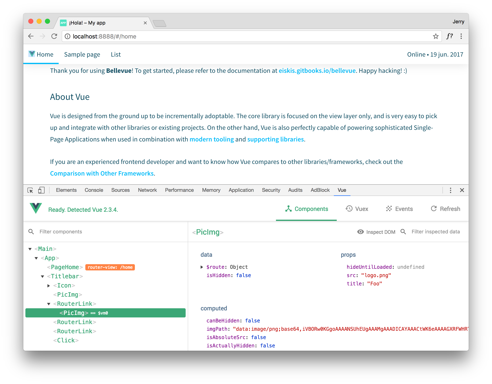
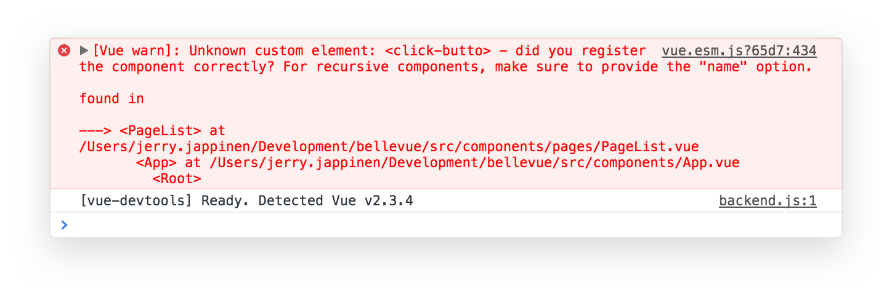
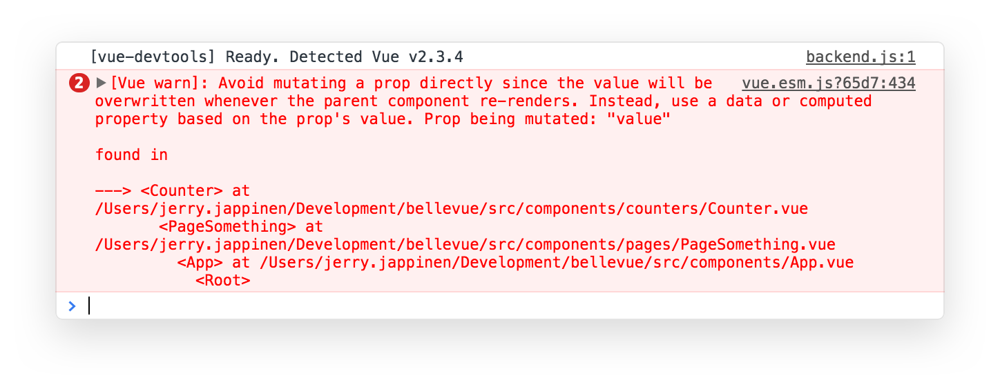
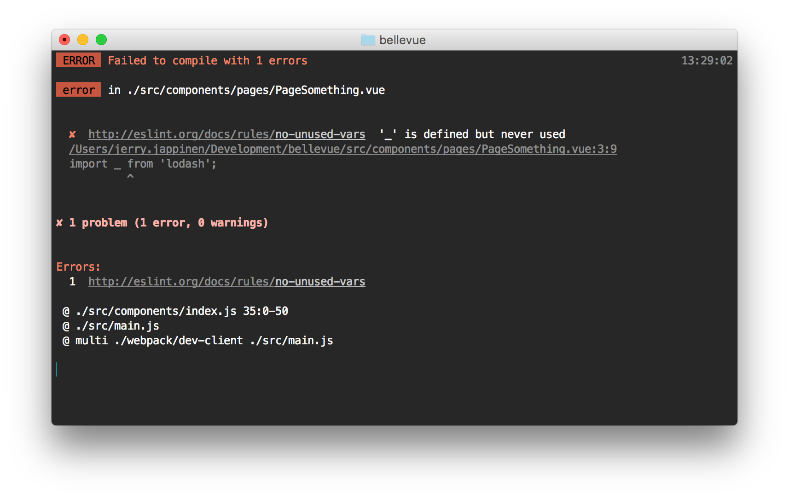
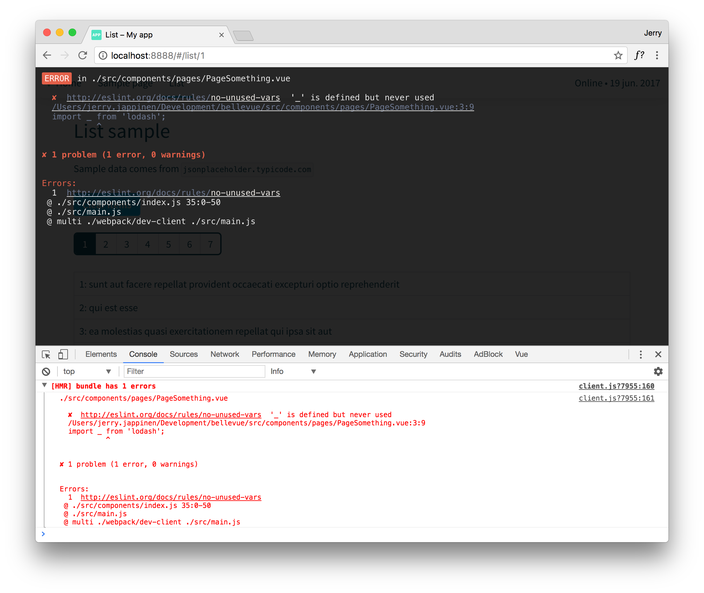

# Development builds

The following development tools have been configured for development aids:

- EditorConfig
- ESLint: JS linting
- htmllint: HTML linting
- Stylelint: Sass linting

During development, Webpack will automatically recompile any of the assets needed and only the components that have changed will be rerendered in the browser. This is called "hot reload" or "module hot swapping". No browser extensions or other setup is required for this.

## Debugging

It's recommended to use the [Vue.js devtools](https://chrome.google.com/webstore/detail/vuejs-devtools/nhdogjmejiglipccpnnnanhbledajbpd?hl=en) Chrome extension for Vue development. This extension can visualize the component tree and expose the state of each component. It also integrates with Vuex.



Any issues detected by the development version of Vue will be reported with detailed messaging in the browser's console. Any other client-side issues will be reported by the browser's console as well, of course.





Compilation errors, including linting issues, are shown on the command line, browser console and overlayed in the browser.





## When to restart dev server

To start the local development server, you use this comand:

```sh
npm run dev
```

Webpack is now running, listening for any changes you make to the app source and will do any and all recompilation needed to push an up-to-date version of your code and assets to the browser via hot module replacement and other tricks.

During normal application development you won't have to restart the development server. However it might be required in the following situations:

- When you change Webpack configuration under `webpack/`.
- When you want changes under `src/config/` to be reflected in `src/index.html.js`.
- When you edit dependencies in `package.json` or otherwise mess with `node_modules`.
