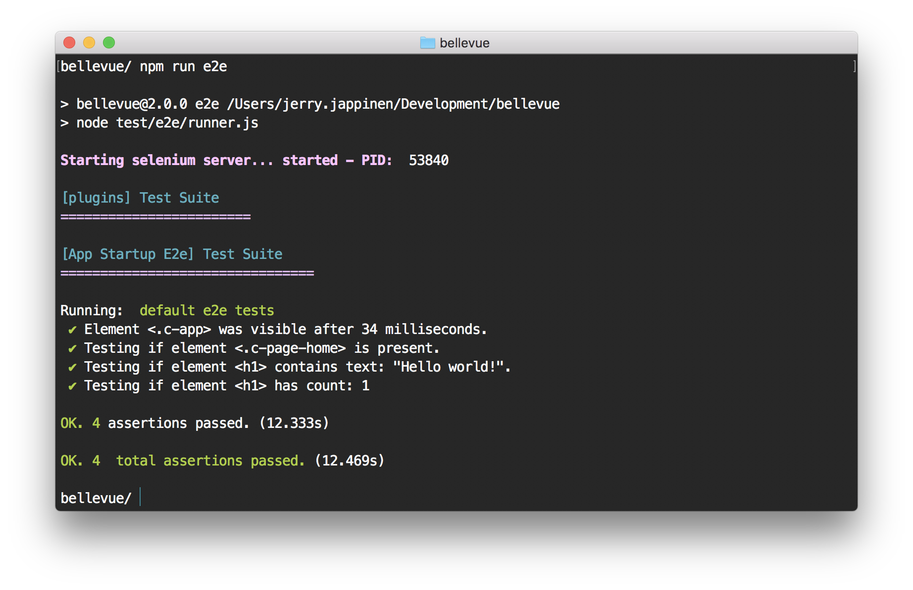

# Testing

## Unit tests

```
test/
	|_ unit/
		|_ coverage/
			|_ lcov-report/
				|_ index.html
		|_ specs/
			|_ components/
			|_ models/
			|_ store/
```

Automated unit tests run on [Karma](https://karma-runner.github.io/1.0/index.html) and [Mocha](https://mochajs.org/), and are written using [Chai](http://chaijs.com/). Unit tests can be written for all the elements of application code, meaning services, models, components and utilities as well as Vuex code.

Running unit tests on the command line gives you a report like this:


The test pipeline will also generate an HTML report, which looks like this:


The HTML report will be available under  `/test/unit/coverage/lcov-report/`. You can open it over `file://`, no file server is needed.

## End-to-end tests

```
test/
	|_ e2e/
		|_ custom-assertions/
		|_ specs/
```

Automated end-to-end tests are written using [Nightwatch.js](http://nightwatchjs.org/) and run via Selenium. When running the tests, you will see test report in your CLI that looks like this:


